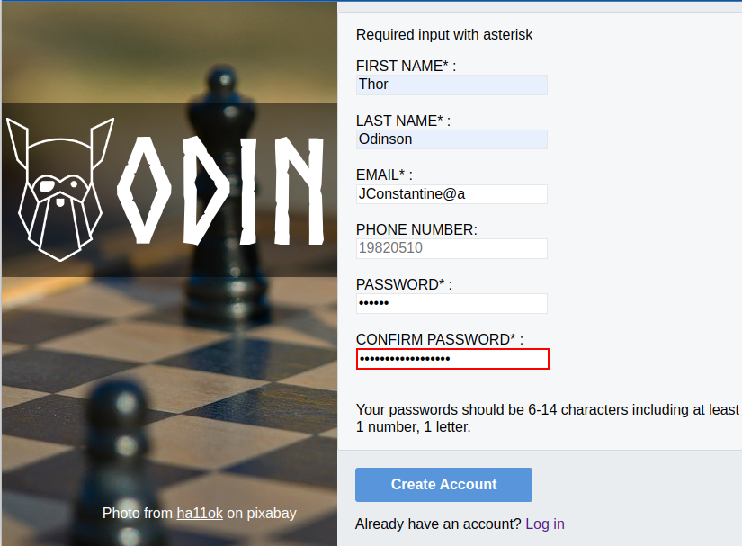

# odin_sign_up_form

[Live preview](https://maxim55069633.github.io/6.odin_sign_up_form/)

This project aims to create a sign-up form. It helps me to hone my skills on form in HTML and CSS.

I successfully overcome the following obstacles:
1. Place a submit button outside a form but build a connection between them.
2. Reset browser default css.
3. Set a transparent background div on a image.
4. Apply new custom font to the text.
5. Use regular expression to validation users' input.
6. Use javascript to customize a client-side input validation.
7. Use position:sticky to create a desktop-level responsive deisgn.

The sample provided by The Odin project:

my solution:
maximize window view:

resize window view:

