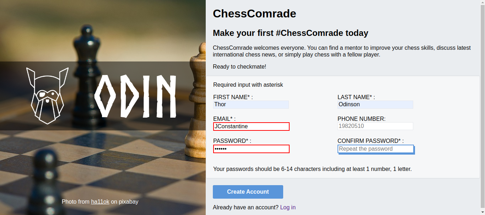

# odin_sign_up_form

[Live preview](https://maxim55069633.github.io/odin_sign_up_form/)

This project aims to create a sign-up form for chess lovers. I apply most of the new techinques I have learned in the module of Intermediate HTML and CSS. I also successfully solve the following problems:
1. how to place a submit button outside a form but build a connection between them?
2. how to reset browser default css?
3. how to set a transparent background div on a image?
4. how to apply new custom font to the text?
5. how to use regular expression to validation users' input?
6. how to use javascript to customize a client-side input validation?
7. how to use position:sticky to create a desktop-level responsive deisgn?

The sample provided by The Odin project:

my solution:
maximize window view:

resize window view:

